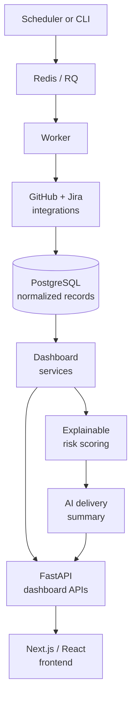

Engineering teams rarely lack data. They lack a reliable way to turn that data into a decision.

Pull requests live in GitHub. Work items and sprint commitments live in Jira. Build and delivery signals are spread across repositories, teams, and tools. By the time an engineering leader assembles a picture of what changed, what is at risk, and what needs attention, the information is already stale.

I recently completed a proof of concept for an **Engineering Intelligence Platform** to address that problem. The goal was not to create another activity feed. It was to build a focused delivery-health view that answers three practical questions:

1. What changed recently?
2. What is becoming risky?
3. What should the team investigate next?

This post explains the design decisions behind the project and the engineering problems they solve.

## Starting with the decision, not the data

The first design challenge was resisting the temptation to expose every field returned by GitHub and Jira. A dashboard that mirrors provider APIs may be technically complete, but it still leaves users to interpret the data themselves.

Instead, the platform is organized around delivery concepts:

- Pull requests and their movement over time
- Sprint and delivery risk
- Releases and off-timeline work
- Repositories receiving unusual activity
- A concise daily delivery summary

This distinction shaped the rest of the system. Integrations collect provider-specific data, but the dashboard consumes a stable, normalized model designed around decisions rather than APIs.

## Architecture: separate collection from consumption

The platform uses a Next.js, React, and TypeScript frontend backed by a FastAPI, SQLAlchemy, and PostgreSQL service. Redis and RQ handle asynchronous ingestion work.

The architecture has two intentionally separate paths:



This separation solves two different reliability problems:

- **Collection should not block the user experience.** Synchronizing external systems can be slow, rate-limited, or temporarily unavailable. It belongs in background jobs.
- **The dashboard should not depend on provider response shapes.** Once data is stored in normalized tables, the read path can remain predictable even when an integration evolves.

The backend tracks each ingestion run with its status, attempt count, timestamps, and synchronization counts. Errors are sanitized before they are persisted, which gives operators useful diagnostic information without storing credentials or raw provider payloads.

## Idempotent ingestion makes retries safe

External synchronization is inherently retryable. Networks fail, APIs throttle requests, and workers can restart halfway through a run. A retry strategy is only useful if repeating a job does not create duplicate records.

The ingestion services therefore use provider identifiers and idempotent upserts. GitHub and Jira records are mapped into the platform's domain model, then inserted or updated using stable identity and organization context.

This gives the system an important operational property: a failed run can be retried without requiring manual database cleanup.

It also makes the boundary between integrations and the rest of the application clearer. Provider clients are responsible for fetching and mapping data; dashboard services are responsible for presenting the resulting domain records.

## Normalize at the API boundary

One of the most important decisions was to avoid allowing raw GitHub or Jira payloads to cross the API boundary.

Provider payloads are optimized for provider functionality. They contain nested structures, provider-specific status names, optional fields, and details that are irrelevant to a delivery dashboard. Passing them directly to the frontend would couple the UI to two external schemas and spread transformation logic across components.

Instead, the backend exposes normalized dashboard contracts. The frontend receives the concepts it needs—KPI values, risk items, releases, repositories, and summary content—without knowing how each provider represents them.

That improves the system in three ways:

1. **Frontend simplicity:** components render product concepts instead of parsing integration details.
2. **Integration flexibility:** GitHub or Jira mappings can change without forcing a UI rewrite.
3. **Contract stability:** API tests can protect the shape that users and frontend code actually depend on.

The platform also handles the empty state deliberately. When no source data is available, the overview still returns the organization profile and empty collections. The dashboard can explain that it has no data yet instead of failing with a misleading error or rendering broken cards.

## Make metrics deterministic before making them intelligent

A delivery dashboard becomes difficult to trust when the same data produces ambiguous results. The KPI calculations use explicit comparison windows so that changes are reproducible:

- Open and merged pull requests are compared over seven-day windows.
- Failed builds use the same seven-day comparison approach.
- Blocked tickets compare yesterday with the previous day.

These rules are less impressive than a vague “health score,” but they are much more useful. A user can understand why a number changed, and tests can verify the result.

The same principle applies to risk scoring. The platform uses a versioned, explainable risk model (`risk-v2`) that combines source status and risk classifications with pressure signals. Pressure signals are capped so that one noisy metric cannot dominate the entire result.

This is an important product decision: a risk score should prioritize investigation, not pretend to be an unquestionable truth. Each signal needs to be explainable enough for an engineering leader to decide what to do next.

## Use AI as a reasoning layer, not a source of truth

The AI-generated delivery summary is deliberately placed after deterministic processing.

The backend first computes and normalizes risk facts. Only those facts are sent to the language-model gateway. The response is required to use a strict JSON shape, and the service includes prompt versioning, model fallbacks, and confidence normalization.

This design avoids asking a model to discover operational truth from arbitrary provider payloads. The model summarizes facts that the application has already selected and validated.

The result is a better division of responsibility:

- Code calculates counts, windows, statuses, and risk signals.
- AI explains the most relevant story in a form that is faster to read.
- The dashboard still works when AI is unavailable.

That last point matters. AI should improve the workflow, but it should not become a single point of failure for basic delivery visibility.

## Keep the frontend focused on the user's workflow

The frontend dashboard is built as a set of focused sections rather than one large component. KPI cards establish the current state, while releases, off-timeline epics, risk intelligence, active repositories, and the delivery summary provide progressively more context.

Initial overview and risk data are loaded through the application layout and made available through a dashboard provider. The summary has its own Next.js route that proxies the backend endpoint, keeping the client-facing boundary consistent with the rest of the application.

This structure keeps data orchestration separate from presentation. Components can focus on states such as loading, empty data, and meaningful results instead of managing every backend request themselves.

## What I learned

The main lesson from this project is that engineering intelligence is not created by aggregating more events. It is created by introducing a disciplined sequence:

```js
Collect -> Normalize -> Measure -> Explain -> Act
```

Each step addresses a different failure mode:

- Collection without normalization creates vendor lock-in.
- Normalization without measurement creates a passive data store.
- Measurement without explainability creates distrust.
- Explanation without reliable facts creates noise.
- All of the above without a clear action leaves the user with another dashboard to check.

The most valuable part of the implementation was therefore not any individual screen or integration. It was establishing trustworthy boundaries between external systems, domain data, deterministic analysis, and AI-assisted communication.

## Closing thoughts

There is no universal definition of a healthy engineering organization, and there is no perfect delivery score. A useful platform must reflect the questions a team is trying to answer, make its assumptions visible, and remain useful when data is incomplete.

This project was a practical exploration of that idea: combine GitHub and Jira signals, preserve a clean data contract, calculate explainable risks, and use AI to reduce the time required to understand the result.

A potential next step would be an interactive engineering assistant that can answer questions in real time using the same normalized delivery data. Instead of asking a user to navigate several dashboard sections, the assistant could respond to questions such as:

- "Which initiatives are most likely to miss their target this sprint?"
- "Why has delivery risk increased for this repository?"
- "Find the issues blocking the release and group them by root cause."
- "What actions could reduce this risk before the next planning meeting?"

To be useful, that assistant would need to do more than retrieve records. It could correlate pull requests, Jira issues, release timelines, build failures, and historical risk signals; identify the likely root cause of a delivery problem; explain the evidence behind its conclusion; and propose potential solutions with clear trade-offs. For example, it might distinguish between a scope problem, a review bottleneck, a failing build pipeline, or an external dependency, then recommend actions such as narrowing scope, reassigning reviewers, fixing the pipeline, or escalating a dependency.

The assistant should remain grounded in the platform's deterministic data and show its sources rather than presenting an unsupported answer. That keeps the interaction conversational without sacrificing trust, auditability, or human judgment.

There is significant room to take this platform further: proactive alerts, natural-language investigation, trend detection, delivery forecasting, and workflow integrations that help teams act on insights directly. The important part is to grow from validated engineering problems instead of adding intelligence for its own sake. The POC establishes the foundation; the larger opportunity is to turn that foundation into an always-available partner for understanding and improving software delivery.
